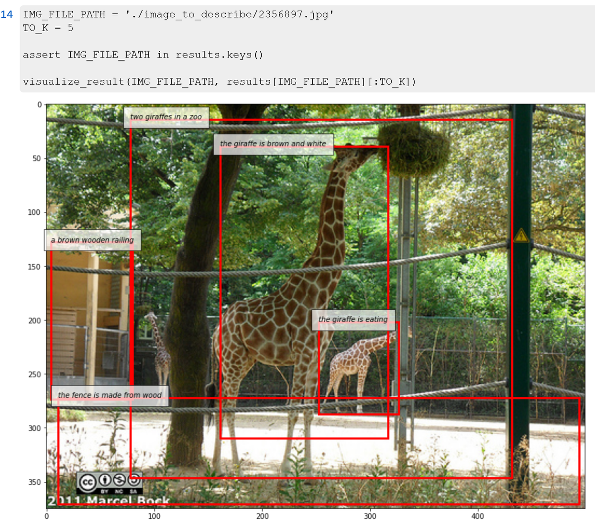

# Transfer Dense Captioning to SNARE

## Installation
We use python 3.8 for our experiments, other version may work.
1. If you like, create a python environment and activate it, for example using conda: `conda create -n dnscp python=3.8 && conda activate dnscp`
2. Install the dependencies using pip and the provided requirements file by running: `pip install -r requirements.txt`
## Data
For the SNARE evaluation, the fold information and model screenshots are needed.
The training and validation folds are defined in [this link](https://github.com/snaredataset/snare) repository which per default should be cloned in the parent directory to '../'. The ShapeNetSem screenshot data can be retrieved from [this link](https://shapenet.cs.stanford.edu/shapenet/obj-zip/ShapeNetSem.v0/models-screenshots.zip) and by default should be extracted to `../snare/data/`.
If your configuration varies, just set the `--snare-annotations-path` and `snare-screenshots-path` arguments respectively.

Below is a list of model trained parameters that can be downloaded and used for further training or evaluation. Please see the corresponding sections for details how to use them.

| Model Name (as written in the Thesis)  |
| -------- |
| [baseline](https://uni-bielefeld.sciebo.de/s/FZUPbkWW8Ohz4nI) |
| [CVP+DCS](https://uni-bielefeld.sciebo.de/s/mxmLbaSQNp2abDs) |
| [CVP+DCS+MV_DCS](https://uni-bielefeld.sciebo.de/s/mp3bv3wAywhIdX3) |
| [CVP+DCS+MV](https://uni-bielefeld.sciebo.de/s/NjKYL4G0RjsgYT4) |
| [CVP+DCS+V](https://uni-bielefeld.sciebo.de/s/NETzThInMuUIuJL) |
| [CVP+DCS+V+MV_DCS](https://uni-bielefeld.sciebo.de/s/IEgs4HHKH9Qqlnc) |
| [CVP+DCS+V+MV](https://uni-bielefeld.sciebo.de/s/McGsrRgqiftDBVY) |
| [CVP+DCS+VC](https://uni-bielefeld.sciebo.de/s/hMK4rGtV7oDuRE6) |
| [CVP+DCS+VC+MV_DCS](https://uni-bielefeld.sciebo.de/s/oNyeNE2ovGdwbNt) |

By default, the model params files (`<name>.pth.tar`) need to be placed in the `./model_params` folder. If you want to place them elsewhere, you need to specify `--params-path` when running the scripts.
Additionally, the models require a `config.json` file which is available [here](https://uni-bielefeld.sciebo.de/s/N8TSi7OcoKf1Nd7). Please place this file in your `model_params` directory (or specify a different path using `--config-path`).
Finally, the pre-processing file containing tokenization dictionaries available [here](https://uni-bielefeld.sciebo.de/s/WLz83hR6U2iuwuN) needs to be placed in `./data` (or otherwise specified by `--lookup-tables-path`). For other tokenization settings, please refer to the *Pre-process* and *Start Training* sections in the original README below.

## Pre-training
We provide a pre-trained version of our model on Visual Genome which we refer to as `baseline` in the list above.

If you want to perform pre-training for yourself, please consult the sections *Pre-process* and *Start Training* of the original README below to pre-process the visual genome data for pre-training.

## Fine tuning on SNARE
Fine tuning is started using the `snare_eval.py` script by providing the `--train` argument flag. The following arguments are relevant for fine tuning:

```
  --alternating         Train whole network for the first epoch half, only region view prediction for the second half.
                        (default: False)
  --config-path CONFIG_PATH
                        Path of a folder containing the models config.json file (default: model_params)
  --epochs EPOCHS       Max epochs to train. (default: 3)
  --lookup-tables-path LOOKUP_TABLES_PATH
                        Path to the pickled look up tables for tokenization created while preprocessing VG. (default:
                        ./data/VG-regions-dicts-lite.pkl)
  --losses LOSSES [LOSSES ...]
                        Specify the losses to be included for training. Default value contains all possible losses.
                        (default: ['v', 'mv', 'vc', 'dcs', 'mv_dcs', 'cvp'])
  --model-name MODEL_NAME
  --model-prefix MODEL_PREFIX
                        Prefix used for model checkpoint saves. Defaults to current timestamp. (default: 1694945456)
  --params-path PARAMS_PATH
                        Path to the model checkpoint folder. (default: model_params)
  --snare-annotations-path SNARE_ANNOTATIONS_PATH
                        Path to the SNARE annotation files. (default: ../snare/amt/folds_adversarial)
  --snare-screenshots-path SNARE_SCREENSHOTS_PATH
                        Path to the SNARE/ShapeNetSem model screenshots. (default: ../snare/data/screenshots)  
  --train               Train/Finetune the model on the SNARE training dataset (default: False)
```

For example, a model fine tuning the baseline model named `baseline` and optimizing the CVP, DCS and V loss for four epochs can be trained using:
`python snare_eval.py --model_name baseline --train --losses cvp dcs v --epochs 4`

## Evaluation on SNARE
When ommitting the `--train` flag, the SNARE reference resolution task is evaluated on the validation set per default. In addition to the arguments listed above, other evaluation metrics can be started using the arguments listed below.

```
--test-categories     Compare the models performance on SNARE object categories. (default: False)
--test-view-iterations TEST_VIEW_ITERATIONS
                      Iterations to test when '--test-view' is specified. (default: 10)
--test-view           Test random vs. predicted vantage point performance. (default: False)
```

### Hardware
Fine tuning was performed on an NVIDIA P100 16GB while the SNARE inference also was able to run on NVIDIA GTX 1060 6GB.

---

### below is the original README from the [upstream repository](https://github.com/soloist97/densecap-pytorch).

---

# Densecap in Pytorch

A simplified pytorch version of [jcjohnson/densecap](https://github.com/jcjohnson/densecap)
> Issue or Contact me directly by yhshi@bupt.edu.cn

## What is densecap?
* Detect regions from an image and describe each region with a short sentence. 
  
* See [jcjohnson's repo](https://github.com/jcjohnson/densecap) or [their paper](https://cs.stanford.edu/people/karpathy/densecap/)

## What about this implementation?
* Things are up to date: Python 3.7 and pytorch 1.4.0
* Our model code inherits GeneralizedRCNN from [torchvision](https://pytorch.org/vision/stable/index.html) directly and try to keep it easy to understand and use (wish to be). **So the region detector part is not the same as the original paper**.
* Should be trainable on a single GTX 1080Ti GPU with 12GB memory.

## Requirments
* python 3.7
* pytorch 1.4.0 
* torchvision 0.5.0
* numpy
* PIL
* h5py
* tqdm
* tensorboard
* Prefetch version of DataLoader: https://github.com/IgorSusmelj/pytorch-styleguide/issues/5
* apex: https://github.com/NVIDIA/apex (to speed up training)
* nlgeval*: https://github.com/Maluuba/nlg-eval

> **Note**: We use nlgeval to calculate Meteor, you can modify evaluate.py to use other methods like coco-eval.

## Pre-process

1. `mkdir ./data` and place [Visual Genome Dataset](http://visualgenome.org/) in a sub directory `visual-genome`
    * Images are in two directories `./data/visual-genome/VG_100K` and `./data/visual-genome/VG_100K_2`
    * Annotation files are `./data/visual-genome/region_descriptions.json` and `./data/visual-genome/image_data.json`
2. `python preprocess.py`
3. Now we get `./data/VG-regions-dicts-lite.pkl` and `./data/VG-regions-lite.h5`. See preprocess.py for more details.
4. After preprocessing, file structures are listed below:
```
    data
    ├── visual-genome
    │   ├── VG_100K
    │   ├── VG_100K_2
    │   ├── region_descriptions.json
    │   └── image_data.json
    ├── VG-regions-dicts-lite.pkl
    └── VG-regions-lite.h5
```


## Start Training

1. `mkdir model_params`
2. `python train.py`
3. change settings by `set_args()` and global variables

## Evaluating

> Since we need to combine metrics from vision and language, we rewrite the [Lua version](https://github.com/jcjohnson/densecap/tree/master/eval) and the code is in `./model/evaluator.py`.

* We provide functions to evaluate in the script `evaluate.py`. 
* You can use `describe.py` to do inference on your images.
* Visualize bounding boxes and their descriptions in `vg_dataset_visualization.ipynb`

## Trained model

We provide a playable checkpoint, Here is the link - [OneDrive](https://1drv.ms/u/s!AmN4YCVEJTAIhcEL0HQDwgl79REDzQ?e=xYKEO1) or [BaiduYun](https://pan.baidu.com/s/17-4CnOWHK-ksLKRAzC2JVQ) (code is `lysh`)
* It is initiated from the pretrained torchvision Faster R-CNN and trained for at most 10 epochs on the training set.
* Place the checkpoint (`.pth.tar`) and the directory under `./model_params` 

Performance on the val set (`train_all_val_all_bz_2_epoch_10_inject_init.pth.tar`):
```json
{
  "map": 0.09381764795879523,
  "ap_breakdown": {
    "iou_0.3_meteor_0": 0.27547998070716856,
    "iou_0.3_meteor_0.05": 0.20472119629383087,
    "iou_0.3_meteor_0.1": 0.1440167324244976,
    "iou_0.3_meteor_0.15": 0.07862544938921928,
    "iou_0.3_meteor_0.2": 0.042336766347289084,
    "iou_0.3_meteor_0.25": 0.023921287432312966,
    "iou_0.4_meteor_0": 0.2457992273569107,
    "iou_0.4_meteor_0.05": 0.18552129060029984,
    "iou_0.4_meteor_0.1": 0.13265080079436303,
    "iou_0.4_meteor_0.15": 0.07398858115077019,
    "iou_0.4_meteor_0.2": 0.04003382280468941,
    "iou_0.4_meteor_0.25": 0.02333026934415102,
    "iou_0.5_meteor_0": 0.20341708421707153,
    "iou_0.5_meteor_0.05": 0.15629490286111833,
    "iou_0.5_meteor_0.1": 0.11364261746406555,
    "iou_0.5_meteor_0.15": 0.06471541225910186,
    "iou_0.5_meteor_0.2": 0.035920637771487234,
    "iou_0.5_meteor_0.25": 0.021687612012028692,
    "iou_0.6_meteor_0": 0.15223818764090538,
    "iou_0.6_meteor_0.05": 0.11921414405107499,
    "iou_0.6_meteor_0.1": 0.08984904080629348,
    "iou_0.6_meteor_0.15": 0.052889608442783356,
    "iou_0.6_meteor_0.2": 0.03046290695667267,
    "iou_0.6_meteor_0.25": 0.018970464691519737,
    "iou_0.7_meteor_0": 0.09079854160547257,
    "iou_0.7_meteor_0.05": 0.07260968565940856,
    "iou_0.7_meteor_0.1": 0.056333212852478026,
    "iou_0.7_meteor_0.15": 0.03415838725864887,
    "iou_0.7_meteor_0.2": 0.01916669186204672,
    "iou_0.7_meteor_0.25": 0.011734895706176758
  },
  "detmap": 0.25295563289523126,
  "det_breakdown": {
    "iou_0.3": 0.37301586389541624,
    "iou_0.4": 0.3269594985246658,
    "iou_0.5": 0.26560761243104936,
    "iou_0.6": 0.18992780923843383,
    "iou_0.7": 0.10926738038659095
  }
}
```

## Developer
* [soloist97](https://github.com/soloist97)
* [fuyun1107](https://github.com/fuyun1107)